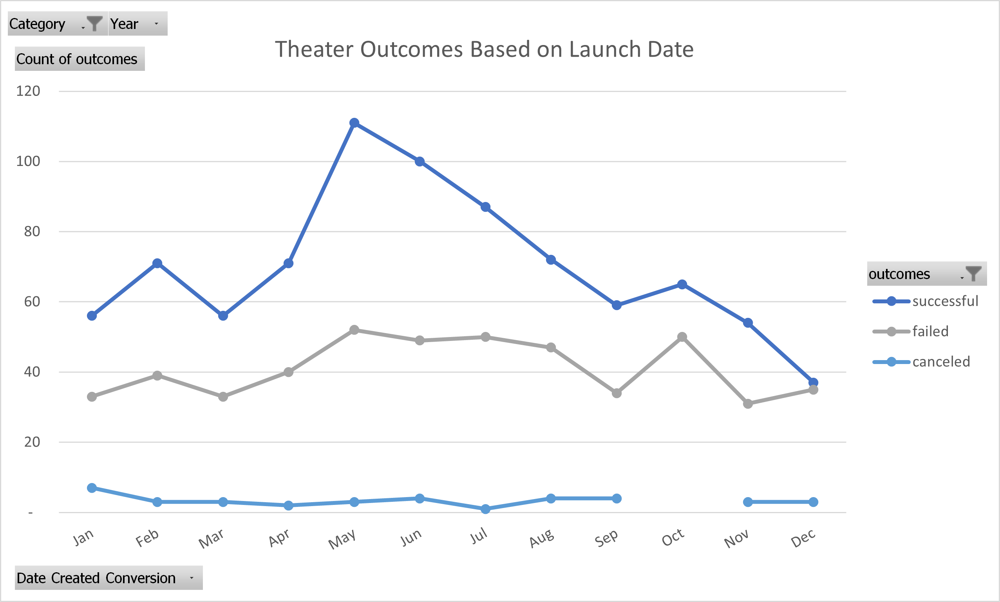
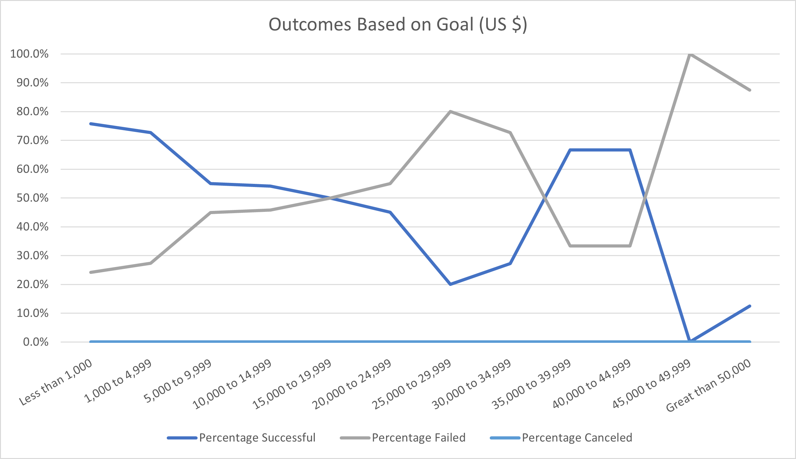

# An Analysis of Theater Kickstarter Data
## Overview of Project
Our client, Louise, recently concluded a Kickstarter campaign for the play Fever, which nearly achieved the initial fundraising goal in a short time. The initial campaign goal was $10,000. The client has requested additional information to determine how the Fever campaign fared in relation to other Kickstarter campaigns for plays, specifically the outcome of the project based on launch date and the outcome of the project based on funding goals. The following documentation provides the results and conclusion of the project.
### Purpose
An analysis of comparable campaigns is necessary to ensure the Client’s campaign was as successful as other plays or if modifications could be made to increase the chances of success. The visual representation of our findings provides a simple way to determine trends within the information. Factors such as time of the campaign launch and total funding goal (in dollars) can impact the outcome. The following charts and graphs encompass relevant results to the Client’s Kickstarter campaign. 
## Analysis and Challenges
A multitude of Kickstarter campaigns in 9 parent categories (Figure 1) inclusive of a total of 41 subcategories (Figure 2) were utilized in the initial data set. The **Theater Category**, which consisted of 1,393 individual Kickstarter, was further divided into 3 subcategories (plays, musicals, spaces). The **Plays Subcategory** included 1,066 data points.

Figure 1 – chart of all Kickstarter campaign parent categories, a total of 4,114 across 9 parent categories. Note the Theater category comprises 33.9% of campaign data provided. 

Figure 2 – chart of all Kickstarter campaign subcategories, a total of 4,114 across 41 subcategories. Note the Plays category comprises of 25.9% of the total campaigns. 

### Analysis of Outcomes Based on Launch Date
The initial factor analyzed in the post campaign review was the month in which a campaign was launched. Figure 3 illustrates all theater campaign outcomes based on launch month. The most successful month to launch a theater campaign is either May or June. May launched a total of 166 theater campaigns, with 111 successful campaigns, or 66.9% success rate. June launched a total of 153 campaigns, with 100 successful campaigns, or 65.7% success rate. In contrast, the months of December (37 successful) and October (65 successful) produce the lowest success rates, with 49.3% and 56.5%, respectively, of launch campaigns succeeding. 

 Figure 3

### Analysis of Outcomes Based on Goals
Success in a campaign may be correlated with the initial fundraising goal. When analyzing all US campaigns, successful campaigns had a mean goal of $5,049, with failed campaigns requesting on average more than 2 times that amount. Figure 4 depicts several dollar ranges for initial funding goals versus the outcome of the campaign. Within the Theater Category, campaigns with an initial fundraising goal of less than $1,000 had a 75.8% success rate, followed by campaigns with an initial fundraising goal between $1,000 and $4,999. Louise’s initial goal for Fever was $10,000, which has a 54.2% success rate for the 72 plays that were included in the data set. 

 Figure 4
### Challenges and Difficulties Encountered

Although no challenges were encountered, possible challenges include incomplete data, incorrect data, or inconsistent information. For example, if several successful campaigns did not provide information or data about their campaign, the researcher would not be able to use that data point. This data set appears to be sufficient but without understanding where the information was derived, the conclusion should be reviewed with professional skepticism. 

## Results

* What are two conclusions you can draw about the Outcomes based on Launch Date?

Based on launch date, a campaign has the highest chance of success in May (66.9%) or June (65.4%). However, a total six months produced higher than the average success rate of 61.3%. For all months except December, a fundraising campaign for Theater can be started and have likely chance of success. The three categories in the Theater Group include plays, musicals, and spaces (locations). As the Plays subcategory is 76.5% of the theater subcategory, the success percentage of the population is likely the success percentage of the plays sample. 

Second, the chances of success in each month may be attributed to factors such as discretionary spending money, likelihood to attend the event, or seasonal preference for entertainment. Additional research is needed to conclude on this option. 

* What can you conclude about the Outcomes based on Goals?

The initial goal of a campaign was $10,000, a goal which was nearly reached. This is an indication that the campaign failed to meet the goal. The $10,000 to $14,999 range for successful plays is 54.2%, or just over half of the 72 projects in this range achieving their desired goal. In further analysis of the Fever campaign and comparable projects, failed campaigns in the $10,000 to $14,999 were funded in a range of 0% to 37%. Thus, if the Fever campaign was *nearly* funded to the goal, this could be considered a well performing campaign. 

* What are some limitations of this dataset?

Although extensive, the data set provided may not be an exhaustive list of related Kickstarter campaigns. We are not aware if the set is the total population or a sample of the population. Further, since we did not directly source the data, manipulation may have occurred prior to receipt, ultimately skewing results presented. 
The data provided may not be relevant to the current environment. Dates range from May 2009 to March 2017, which may not be sufficient for a current production. Outcomes may have shifted for the analyzed factors based on year, number of other similar campaigns, or trends for the specific period. 
The location of the campaign initiator may also be a factor in the success. Larger metropolitan areas have an increased demand for plays as entertainment than smaller, rural markets. If provided, the analysis would need to factor the location of the play as it may impact success. 

* What are some other possible tables and/or graphs that we could create?

Additional information could include a regression of the outcomes, providing a formula to use to quickly determine success or failure based on several factors. 
